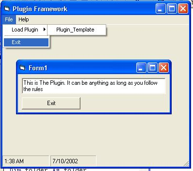



## Plugin Framework \- Simple, Fast ,Dynamic Menus, Registers Dll On Runtime \- Update from Eirler

### Description

IF you like this code please vote or leave a comment,:D:D:D:D . please , chris ;).

I Have been looking for a simple yet usfull plugin framework on psc for about a week. I Couldnt find one so i decided to make my own. Features: Automatic plugin Deletectiom. Adds them to a dynamic menu.Registers Plugin When U Run it and un/registers when you have finished with it. Plugin template Included.

in version 2.

1) Name on plugin menu wont be the plugin dll name . It will be the plug description.

2) Choose What Sub To open in the dll

3) Option not to register the dll

4) Plugin Description

5) Scan HD for plugins. Plugins That are to do with this app will begin with "[Plugin FrameWork]" in the product descripton

6) abilty to open plugin with file open dialog

----

If you have any ideas post them here :), Chris

----

 
### More Info
 

             |
---                |---
**Submitted On**   |2002-07-10 10:53:18
**By**             |[Christopher Hemple](https://github.com/Planet-Source-Code/PSCIndex/blob/master/ByAuthor/christopher-hemple.md)
**Level**          |Advanced
**User Rating**    |5.0 (70 globes from 14 users)
**Compatibility**  |VB 5\.0, VB 6\.0
**Category**       |[Complete Applications](https://github.com/Planet-Source-Code/PSCIndex/blob/master/ByCategory/complete-applications__1-27.md)
**World**          |[Visual Basic](https://github.com/Planet-Source-Code/PSCIndex/blob/master/ByWorld/visual-basic.md)
**Archive File**   |[Plugin\_Fra102574752002\.zip](https://github.com/Planet-Source-Code/christopher-hemple-plugin-framework-simple-fast-dynamic-menus-registers-dll-on-runtime-upd__1-36607/archive/master.zip)

